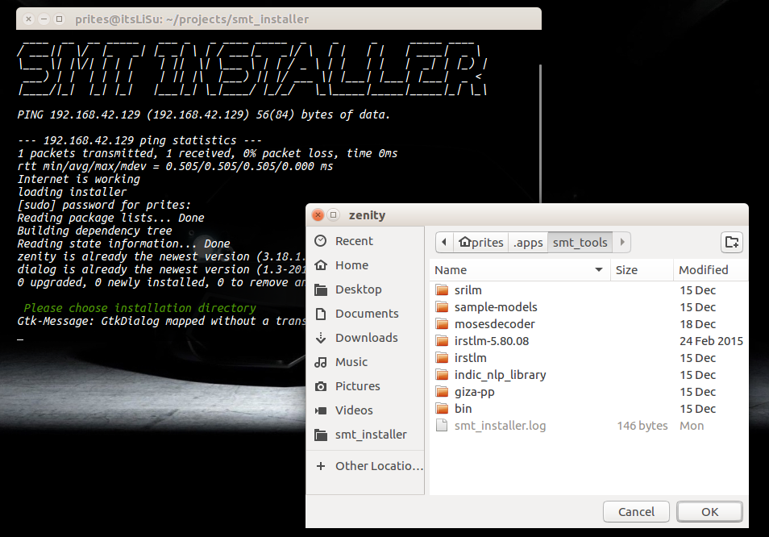
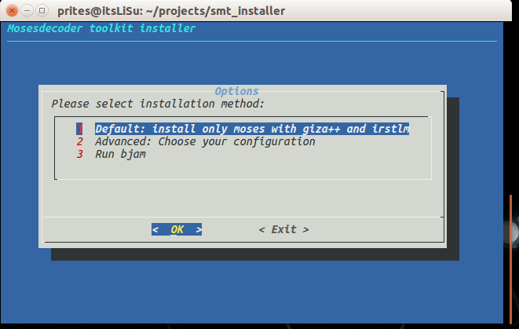
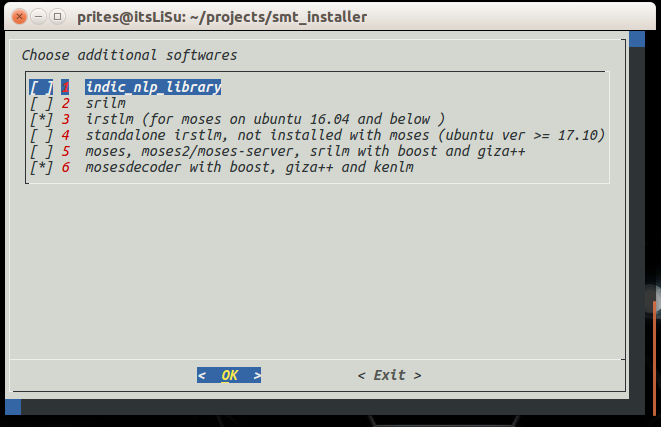

# smt_installer

A shell script installer for statistical machine translation tools like mosesdecoder, moses2, moses-server, giza++, irstlm, srilm, indic nlp library on ubuntu and ubuntu based distros. This script uses "dialog" for its terminal based graphical user interface and zenity for its file chooser dialog-box. All linux packages are installed using apt-get only.
 
The installer is highly configurable and comes with the following options: 
    1. Default: Only Moses, giza-pp, boost and irstlm installation
    2. Advanced: Choose between the different options what to install (like moses, moses2/moses-server, srilm, kenlm, irstlm (with moses), irstlm standalone, indic nlp library)

### Usage

```bash
git clone https://github.com/prites18/smt_installer
cd smt_installer
bash smt_installer.sh
```

### Demo

   


Mosesdecoder is a statistical machine translation toolkit that allows one to
automatically train translation models for any language pair. All we need is a
collection of translated texts.

### NOTE:

Irstlm ver 5.8 fails to compile and install in Ubuntu 17.10 and above. So it is reccomended to use standalone irstlm from apt package manager (also available as an option in the installer). 
Also on Ubuntu systems 12.04 and lower use manual methods for boost cpp libraries installation.


########################################


To add more installation functionality for more programs, go through the following steps:

	1. Add a bash function just before moses_install() function

	2. Write the spinner command as the first coomand in your function ending with and "&" in order to move this process to the background and proceed with installation

	3. Add the installation commands for the installation candidate. To get absolute path for the installation directory use variable "$wdirect"

	4. It is highly recommended to call the error function whenever there is a chance of a fatal error using "|| error" at the end of any command, for example:
						make install || error "optional error message"

	5. Please add echo statements where ever necessary to show status of installation, in the following format:
						echo 'Compiling xyz' | tee -a  $wdirect/smt_installer.log

	6. At the end of the installation script kill the spinner via kill "$!"

	7. It is reccomended to install program binaries and executable scripts to /usr/local/bin for easy access using:
						sudo cp bin/xyz /usr/local/bin/xyz 
						or
						sudo install abc/xyz /usr/local/bin/xyz

	8. Now finally add the option to install the tool in the dialog main menu or advanced configuration menu.


PS: This is just an installer, all the softwares installed by this script have been developed by other people. 
